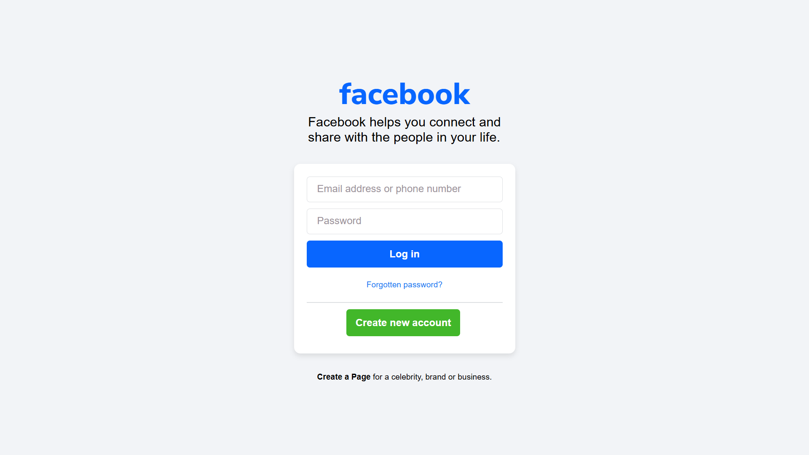

# Facebook Login Page Clone


A frontend replica of the Facebook login page built using HTML and CSS as part of a web development assignment.

---

## 🌐 Live Demo

https://your-username.github.io/facebook-login-page-clone/

---

## 📷 Screenshot

<p align="center">
  
</p>

---

## ⚙️ Project Setup

Clone the repository:

```bash
git clone https://github.com/your-username/facebook-login-page-clone.git
```

---

## 📌 Note

This project is a UI clone created for educational purposes only and does not include any backend functionality.
